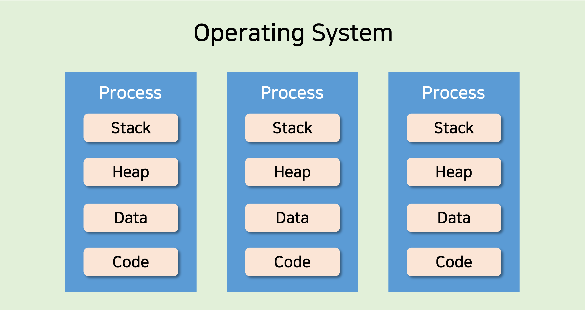
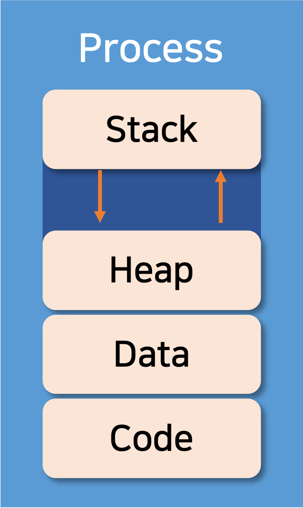

# 📝 프로세스 메모리 구조 (Process Memory Layout)

 

**프로세스**는 실행되고 있는 프로그램으로, 각 메모리 공간을 시스템으로부터 할당 받는다. 프로세스의 메모리는 일반적으로 여러 섹션으로 구분된다.

 

| 섹션 이름      | 설명                                                            |
| -------------- | --------------------------------------------------------------- |
| **Stack**      | 함수를 호찰할 때 임시 데이터 저장장소이다.                      |
| **Heap**       | 사용자에 의해 동적으로 할당되고 해제될 수 있는 메모리 영역이다. |
| **Data**       | 전역 변수와 정적 변수가 저장된다.                               |
| **Text(Code)** | 실행 코드가 저장된다.                                           |

  

### Stack 영역

함수호출과 관련되는 지역변수, 매개변수, 리턴 값 등을 저장하는 영역이다. Stack 영역은 함수 호출 시 생성되며, 함수가 끝나면 반환된다. 
스택 영역은 **`push`** 동작으로 데이터를 저장하고, **`pop`** 동작으로 데이터를 인출한다.
이러한 스택은 **후입선출(LIFO, Last-In First-Out)** 방식에 따라 동작한다.

 

### Heap 영역

필요에 의해 메모리를 동적 할당하고자 할 때 사용하는 메모리 영역으로 동적 데이터 영역이라고 부른다. 메모리 주소 값에 의해서만 참조되고 사용하는 영역이다.
C에서 **`malloc()`**, **`calloc()`** 등으로 프로그래머가 자율적으로 메모리 크기를 할당할 수 있는 영역이다.

 

stack과 heap영역은 같은 공간을 공유한다. 그래서 각 영역이 상대 공간을 침범하는 일이 발생할 수 있는데 이를 각각 **`stack overflow`**, **`heap overflow`** 라고 한다.

 

### Data 영역

전역변수, 정적변수, 배열, 구조체 등이 저장되는 영역이다. Data 영역은 프로그램이 실행될 때 생성되고 프로그램이 종료되면 소멸된다. Data 영역은 **`BSS`** 영역과 **`Data(GVAR)`** 영역으로 나누어지는데, 초기화된 데이터는 Data 영역에 저장되고, 초기화되지 않은 데이터는 BSS 영역에 저장된다.

 

> **`BSS`** 영역, **`Data`** 영역을 구분하는 이유?
>
> 초기화 된 데이터는 초기 값을 저장해야 하므로 Data 영역에 저장되어 rom에 저장된다. 하지만 초기화 되지 않은 데이터 까지 rom에 저장되면 큰 size의 rom이 필요하므로 구분한다(초기화 되지 않은 데이터는 ram에 저장한다).

 

### Text(Code) 영역

실행할 프로그램의 코드가 저장되는 영역으로, CPU는 Code 영역에 저장된 명령어를 하나씩 가져와서 처리하게 된다. 
프로그램을 시작 할 때 컴파일한 프로그램(기계어)이 저장되어 있고, **읽기 전용 영역**이기 때문에 프로세스가 변경 할 수 없고 변경 시 오류를 발생시킨다.

 
 

참조자료

http://tcpschool.com/c/c_memory_structure  
https://kyu9341.github.io/%EC%9A%B4%EC%98%81%EC%B2%B4%EC%A0%9C/2020/10/04/OS_Process_Structure/  
https://velog.io/@cchloe2311/ %EC%9A%B4%EC%98%81%EC%B2%B4%EC%A0%9C-%ED%94%84%EB%A1%9C%EC%84%B8%EC%8A%A4-%EB%A9%94%EB%AA%A8%EB%A6%AC-%EA%B5%AC%EC%A1%B0  
https://recorda.tistory.com/entry/20160503%ED%94%84%EB%A1%9C%EC%84%B8%EC%8A%A4-%EB%A9%94%EB%AA%A8%EB%A6%AC-%EA%B5%AC%EC%A1%B0
