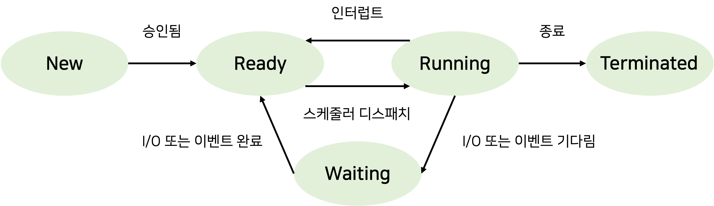

# 📝 프로세스 상태 (Process State), 문맥 교환(Context-Switching)

 

### 상태 종류

| 상태             | 설명                                                   |
| ---------------- | ------------------------------------------------------ |
| 새로운(new)      | 프로세스가 생성된 상태.                                |
| 실행(Running)    | 프로세스에 포함된 명령어가 실행되고 있는 상태.         |
| 대기(Waiting)    | 프로세스가 I/O 또는 이벤트가 발생하기를 기다리는 상태. |
| 준비(Ready)      | 프로세스가 CPU에 할당되기 위해 대기하는 상태.          |
| 종료(Terminated) | 프로세스가 실행을 완료한 상태.                         |

 

### 상태 전이 동작

**Ready(준비) -> Running(실행)** 
Dispatcher가 대기하고 있는 프로그램 중 적절한(우선순위가 높은) 프로그램을 골라 Running 상태로 옮긴다.

 

**Ready(준비) -> Terminated(종료)** 
프로세스가 작업을 완료하여 운영체제가 PCB를 제거하고 메인메모리를 빠져나간다.

 

**Running(실행) -> Ready(준비)** 
CPU는 Time Sharing을 통해 프로세스들을 실행시키므로 프로그램이 길면 timeout이 걸려 Ready 상태로 돌아가게 된다.

 

**Running(실행) -> Waiting(대기)** 
프로세스가 실행중일 때 I/O 또는 이벤트가 발생하는 상황에서 I/O 또는 이벤트가 완료될 때까지 다른 프로세스를 실행시키고 기존 프로세스는 Waiting 상태로 변경한다.

 

**Waiting(대기) -> Ready(준비)** 
I/O 또는 이벤트가 완료되거나 자원이 할당되어 다시 Running 상태로 가기 위해 Ready상태로 변경된다.

  

# 📝 문맥교환(Context Switching)

CPU는 한번에 하나의 프로세스만 처리할 수 있는데, 하나의 프로세스가 CPU를 사용 중인 상태에서 다른 프로세스가 CPU를 사용하도록 하기 위해, 이전의 프로세스의 상태(문맥)를 보관하고 새로운 프로세스의 상태를 적재하는 작업을 **문맥 교환(context switch)** 이라 한다. 한 프로세스의 문맥은 그 프로세스의 **프로세스 제어 블록(PCB)** 에 기록되어 있다.

Context Switching의 비용은 프로세스가 스레드보다 더 많이 든다. 스레드는 Stack 영역을 제외한 모든 메모리를 공유하기 때문에 Context Switching 발생시 Stack 영역만 변경을 진행하면 되기 때문이다.

 
 

참조자료

https://itwiki.kr/w/%ED%94%84%EB%A1%9C%EC%84%B8%EC%8A%A4_%EC%83%81%ED%83%9C 
https://jhnyang.tistory.com/7 
https://enlqn1010.tistory.com/30
